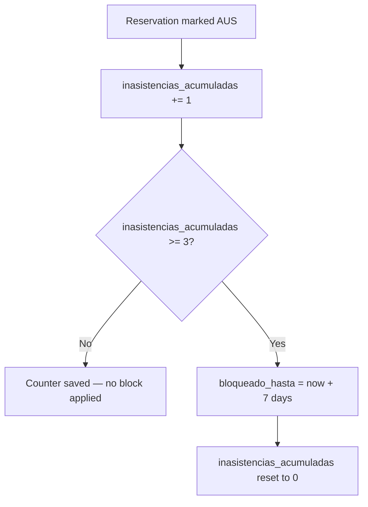

The penalization system discourages no-shows by automatically restricting booking access when a student accumulates too many absences. It is implemented as a Django signal that fires whenever a reservation is marked `AUS` (Absent).

## What triggers a penalization

A penalization occurs when a reservation's `estado` changes to `AUS`. This happens in two ways:

- A trainer explicitly marks a student absent via `POST /api/reservas/{id}/marcar_asistencia/` with `estado: "AUS"`.
- The system auto-closes a past reservation that was still in `PEN` status during block generation.

<Info>
  The signal fires on `pre_save` of `Reserva`. It only acts when `estado` is transitioning **to** `AUS` — re-saving an already-absent reservation does not double-count.
</Info>

## Counter and block logic



<Steps>
  <Step title="Absence recorded">
    When a reservation is marked `AUS`, the student's `inasistencias_acumuladas` field is incremented by 1.
  </Step>
  <Step title="Threshold check">
    If `inasistencias_acumuladas` reaches **3**, the block is applied immediately.
  </Step>
  <Step title="Block applied">
    `bloqueado_hasta` is set to `now() + 7 days`. The student cannot create new reservations until this timestamp is in the past.
  </Step>
  <Step title="Counter reset">
    After applying the block, `inasistencias_acumuladas` is reset to **0**. The cycle can repeat if the student continues to miss sessions after the block expires.
  </Step>
</Steps>

<Warning>
  The block is applied automatically and immediately — there is no grace period or manual approval step. The student is notified of the unblock date in the `400` error response returned when they attempt to make a new reservation.
</Warning>

## Checking block status

Students can check their own status by calling `GET /api/usuarios/me/`. The response includes `inasistencias_acumuladas` and `bloqueado_hasta`.

The `GET /api/usuarios/me/` response includes `inasistencias_acumuladas` and `bloqueado_hasta` indirectly — they are stored on the `Usuario` model and visible in the profile. Check `bloqueado_hasta`: if it is a future datetime, the student is blocked. If `null` or a past datetime, the student can book freely.

```json GET /api/usuarios/me/ — example profile
{
  "id": 7,
  "username": "123456789",
  "first_name": "Pedro",
  "last_name": "Soto",
  "rol": 1,
  "es_seleccionado": false,
  "rama_deportiva": null,
  "carrera": "Ingeniería Civil"
}
```

When a blocked student tries to create a reservation, the API returns:

```json 400 — student is blocked
{
  "error": "Estás bloqueado por inasistencias hasta el 13-04-2026."
}
```

When `bloqueado_hasta` is a future timestamp, the student is blocked. When it is `null` or a past timestamp, the student can book freely.

## Correcting an absence

Trainers can reverse an `AUS` mark by updating the reservation state to `PRE` via `POST /api/reservas/{id}/marcar_asistencia/`.

```json request body
{
  "estado": "PRE"
}
```

<Note>
  Correcting an absence from `AUS` to `PRE` does **not** decrement `inasistencias_acumuladas` or remove a block. If a student was blocked due to the incorrect absence, an administrator must manually adjust `inasistencias_acumuladas` or `bloqueado_hasta` via `PATCH /api/usuarios/{id}/`.
</Note>

A common case for correction is a student who arrived late: the trainer initially marks them absent, then corrects the record once the student is present.

## Quick reference

| Field | Location | Meaning |
|---|---|---|
| `inasistencias_acumuladas` | `Usuario` | Running count of no-shows since last block (0–2) |
| `bloqueado_hasta` | `Usuario` | Datetime until which new reservations are rejected; `null` if not blocked |
| Absence threshold | Signal logic | 3 absences triggers the block |
| Block duration | Signal logic | 7 days from the moment the third absence is recorded |
| Counter after block | Signal logic | Reset to 0 |
