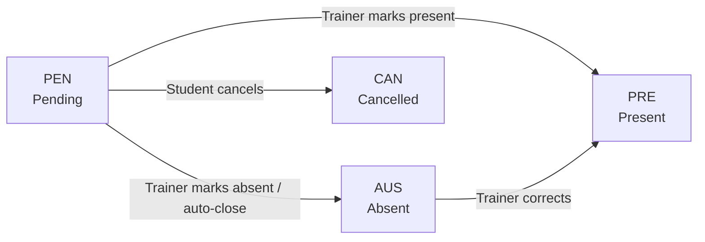

A reservation (`Reserva`) links a student to a specific `BloqueHorario` on a specific date. The system enforces business rules at creation time — capacity limits, daily booking limits, and block status — and tracks each reservation through its lifecycle with four states.

## Reservation states

<CardGroup cols={2}>
  <Card title="PEN — Pending" icon="clock">
    The student has booked the block. Attendance has not yet been recorded. This is the only state that can be cancelled.
  </Card>
  <Card title="PRE — Present" icon="circle-check">
    The trainer has confirmed the student attended the session.
  </Card>
  <Card title="AUS — Absent" icon="circle-x">
    The student did not attend. Triggers the penalization counter. Trainers can correct this to PRE if the student arrived late.
  </Card>
  <Card title="CAN — Cancelled" icon="ban">
    The student cancelled the reservation before the session. Only allowed from PEN status.
  </Card>
</CardGroup>



## Booking flow

<Steps>
  <Step title="Student sends a POST request">
    The student submits a reservation request to `POST /api/reservas/` with the target `bloque` ID and `fecha_especifica`.

    ```json request body
    {
      "bloque": 42,
      "fecha_especifica": "2026-04-08"
    }
    ```
  </Step>
  <Step title="Block status check">
    The system checks whether the student is currently blocked (`bloqueado_hasta` is in the future). If blocked, it returns a `400` error with the unblock date.

    ```json 400 response — student is blocked
    {
      "error": "Estás bloqueado por inasistencias hasta el 13-04-2026."
    }
    ```
  </Step>
  <Step title="Daily limit check">
    The system checks for existing active reservations (`PEN` or `PRE`) on the same `fecha_especifica`. If one exists, the request is rejected.

    ```json 400 response — daily limit reached
    {
      "error": "Ya tienes una reserva hoy para el Módulo 3. Solo se permite 1 módulo por día."
    }
    ```
  </Step>
  <Step title="Capacity check">
    The system counts active reservations for the block. If `reservas_activas >= aforo_regular`:
    - **Regular student** — request rejected with a `400` capacity error.
    - **Selected athlete** (`es_seleccionado = True`) — allowed; reservation is created with `es_sobrecupo = True`.

    ```json 400 response — capacity reached (regular student)
    {
      "error": "Este módulo ya alcanzó su capacidad máxima."
    }
    ```
  </Step>
  <Step title="Reservation created">
    The reservation is saved with `estado = PEN`. The student receives the full reservation object in the response.

    ```json 201 response
    {
      "id": 101,
      "alumno_nombre": "María González (123456789)",
      "bloque": 42,
      "bloque_detalle": { "...": "full block object" },
      "fecha_especifica": "2026-04-08",
      "estado": "PEN",
      "es_sobrecupo": false
    }
    ```
  </Step>
</Steps>

## Business rules summary

| Rule | Detail |
|---|---|
| One reservation per day | A student can only have one active (`PEN` or `PRE`) reservation per calendar day |
| Capacity limit | `aforo_regular` (default 20) active reservations per block |
| Overflow | Students with `es_seleccionado = True` may exceed `aforo_regular`; their reservation is marked `es_sobrecupo = True` |
| Cancellation | Only `PEN` reservations can be cancelled via `POST /api/reservas/{id}/cancelar/` |
| Block check | Blocked students (`bloqueado_hasta` in the future) cannot create new reservations |

## Cancelling a reservation

To cancel, send a `POST` request to `/api/reservas/{id}/cancelar/`. Only the owning student (or an admin) can cancel a reservation, and only when its `estado` is `PEN`.

```bash example
curl --request POST \
  --url https://api.example.com/api/reservas/101/cancelar/ \
  --header 'Authorization: Bearer <token>'
```

**Success response:**

```json
{
  "mensaje": "Reserva cancelada."
}
```

<Warning>
  Cancelling a `PRE` or `AUS` reservation is not allowed. If a student needs a correction, a trainer must update attendance via `POST /api/reservas/{id}/marcar_asistencia/`.
</Warning>

## Attendance marking

Trainers update a reservation's state by calling `POST /api/reservas/{id}/marcar_asistencia/` with the new state.

```json request body
{
  "estado": "PRE"
}
```

<Note>
  Marking a reservation `AUS` triggers the penalization system. See [Penalization system](/concepts/penalization-system) for the counter and block logic.
</Note>

## Reservation fields

| Field | Type | Description |
|---|---|---|
| `alumno` | `ForeignKey` | The student who made the reservation |
| `bloque` | `ForeignKey` | The `BloqueHorario` being reserved |
| `fecha_especifica` | `DateField` | Calendar date of the session |
| `estado` | `CharField` | `PEN`, `PRE`, `AUS`, or `CAN` |
| `es_sobrecupo` | `BooleanField` | `True` if the booking exceeded `aforo_regular` |
